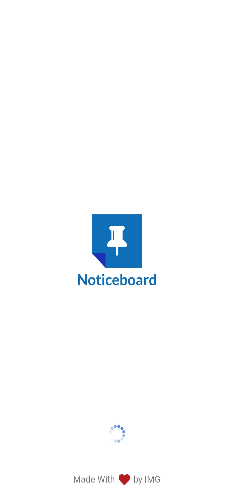
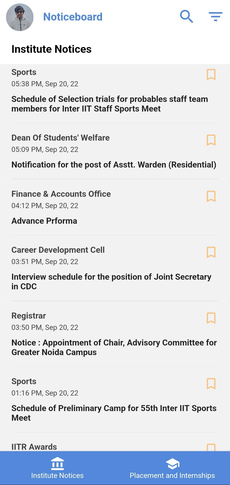
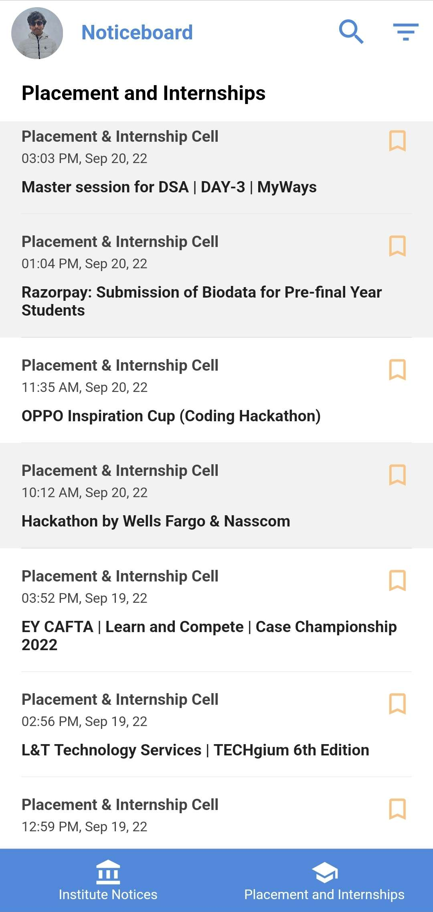
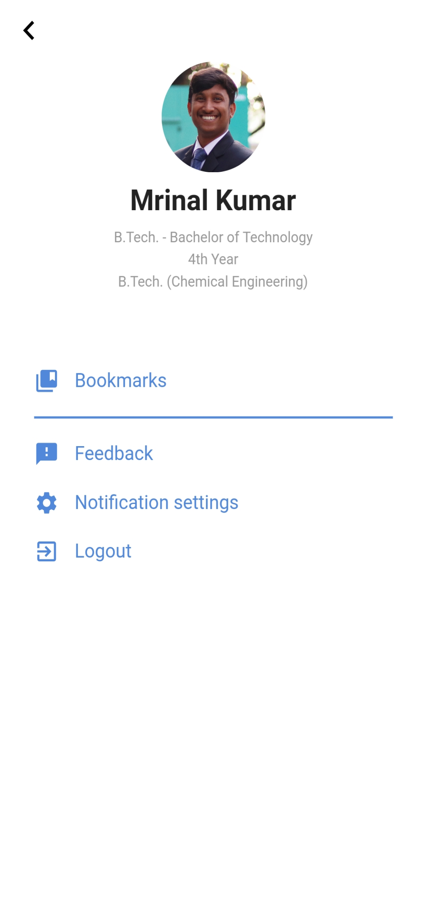
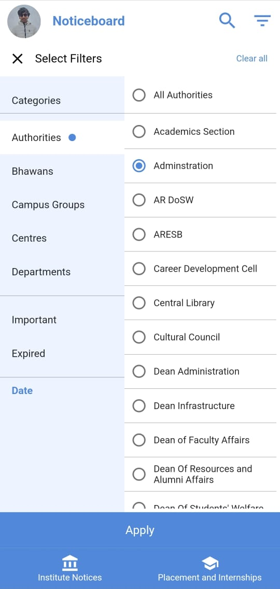
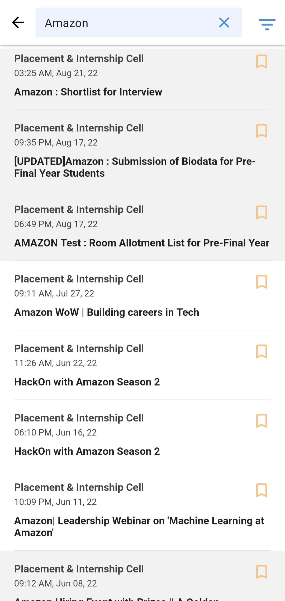
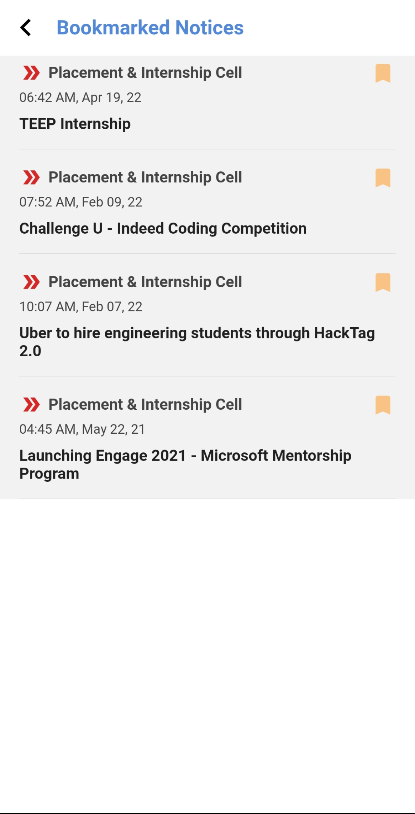

    
    <h1>Noticeboard Mobile App</h1>

     &emsp;
     &emsp;
     &emsp;
     &emsp;
     &emsp;
     &emsp;
     &emsp;

 

## Download the app!
Click the below links to download.
- Android: https://play.google.com/store/apps/details?id=com.img.noticeboard
- iOS: 

## About the app
The official digital noticeboard of IITR. Provides easy access to the Channel i notices, even from outside the campus or without intranet. You must have a Channel i account to use the app.

## Features
- View notices without having to open Channel i, just login and you are set!
- Get notified about the latest notices.
- A separate tab for the ever important placement and intern notices.
- Use that search bar or filter for more fine results.
- Bookmark notices on the go!
- Now after many demands from the iPhone users, noticeboard finally comes on the app store!

## Privacy Policy
Link to privacy policy: https://docs.google.com/document/d/1vsbooZi9PIiVIMaLts2wv0tODEJafCaRT41zsENYN3I/edit

## Tech Stack
- `Flutter` for app code.
- `Firebase` for notifications.

## Release builds (GitHub Actions)

Manual releases run from **Actions → Manual release → Run workflow**.

The workflow uses Flutter **2.10.x** (Dart 2.x) to match [`noticeboard/pubspec.yaml`](noticeboard/pubspec.yaml). Fastlane lives under [`noticeboard/android/fastlane`](noticeboard/android/fastlane) (Play Store) and [`noticeboard/ios/fastlane`](noticeboard/ios/fastlane) (TestFlight upload).

### Inputs

| Input | Purpose |
| --- | --- |
| `platform` | `android`, `ios`, or `both` |
| `release_track` | Play track: `internal`, `beta`, or `production` |
| `build_name` / `build_number` | Optional; passed to `flutter build` (bump `build_number` for every store upload) |
| `dry_run` | Build and sign only; **no** Play upload and **no** TestFlight upload |

### Repository secrets

**Android (Play Store)**

| Secret | Description |
| --- | --- |
| `ANDROID_KEYSTORE_B64` | Base64-encoded release `.jks` / `.keystore` |
| `ANDROID_KEYSTORE_PASSWORD` | Keystore password |
| `ANDROID_KEY_ALIAS` | Key alias |
| `ANDROID_KEY_PASSWORD` | Key password |
| `PLAY_SERVICE_ACCOUNT_JSON_B64` | Base64-encoded Google Play service account JSON (JSON API access enabled in Play Console) |

Encode a file: `base64 -w0 release.jks` (GNU/Linux) or `base64 -i release.jks` (macOS).

**iOS (TestFlight)**

| Secret | Description |
| --- | --- |
| `IOS_DISTRIBUTION_CERT_P12_B64` | Base64-encoded Apple Distribution `.p12` |
| `IOS_DIST_CERT_PASSWORD` | `.p12` password |
| `IOS_PROVISION_PROFILE_B64` | Base64-encoded **App Store** provisioning profile (`.mobileprovision`) for `com.img.noticeboard` |
| `IOS_PROVISIONING_PROFILE_NAME` | Exact profile **Name** as shown in Apple Developer (used in export options) |
| `IOS_TEAM_ID` | Optional; defaults to `RVM9855V5X` from the Xcode project if unset |
| `ASC_KEY_ID` | App Store Connect API key ID |
| `ASC_ISSUER_ID` | App Store Connect issuer ID |
| `ASC_API_KEY_P8_B64` | Base64-encoded `.p8` private key |

The iOS lane uploads to **TestFlight** (`upload_to_testflight`). App Review / production release is still done in App Store Connect.

## Contributing
- Fork the repository to your account.
- Branch out to `a_meaningful_branch_name`.
- Commit your changes.
- Add your name to `CONTRIBUTORS.md`.
- File a `Pull request`.
- Get your pull request merged.

It's that simple!

## Credits

