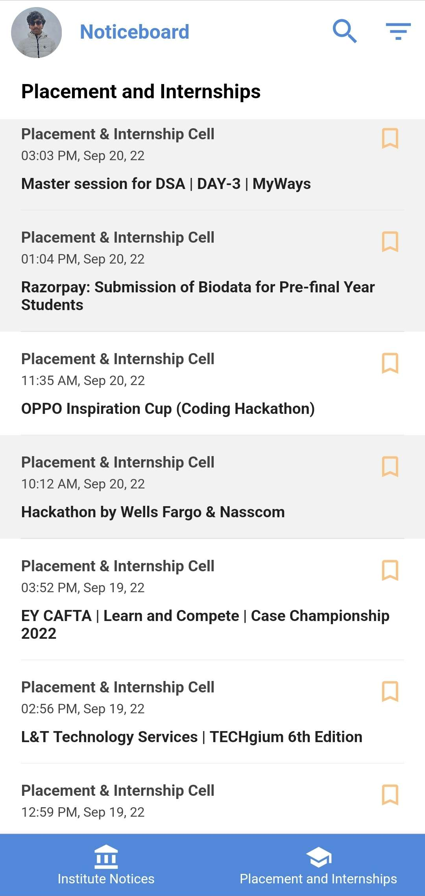

    
    <h1>Noticeboard Mobile App</h1>

     &emsp;
     &emsp;
     &emsp;
     &emsp;
     &emsp;
     &emsp;
     &emsp;

 

## Download the app!
Click the below links to download.
- Android: https://play.google.com/store/apps/details?id=com.img.noticeboard
- iOS: https://apps.apple.com/in/app/channel-i-noticeboard/id6443708603

## About the app
The official digital noticeboard of IITR. Provides easy access to the Channel i notices, even from outside the campus or without intranet. You must have a Channel i account to use the app.

## Features
- View notices without having to open Channel i, just login and you are set!
- Get notified about the latest notices.
- A separate tab for the ever important placement and intern notices.
- Use that search bar or filter for more fine results.
- Bookmark notices on the go!
- Now after many demands from the iPhone users, noticeboard finally comes on the app store!

## Development Setup

### Prerequisites
- Visual Studio Code
- Docker
- Android phone with USB debugging enabled

### Installing VS Code Dev Container Extension
1. Open Visual Studio Code.
2. Go to the Extensions view by clicking on the Extensions icon in the Activity Bar on the side of the window or by pressing Ctrl+Shift+X.
3. Search for "Remote - Containers" and click Install.

### Opening the Project in a Dev Container
1. Clone the project repository.
2. Open the project folder in Visual Studio Code.
3. Press Cmd+Shift+P on Mac or Ctrl+Shift+P on Ubuntu/Windows to open the Command Palette.
4. Search for "Remote-Containers: Open Folder in Container" and select it.
5. Wait for the container to build (this may take some time, especially the first time).

### Setting up Android Phone for Debugging
1. Ensure your phone and PC are connected to the same Wi-Fi network.
2. Enable USB debugging on your phone:
    - Go to Settings > About phone > Software information.
    - Tap "Build number" seven times to enable Developer options.
    - Go back to the main Settings screen, and now you should see "Developer options".
    - Open Developer options and enable USB debugging.
3. Enable wireless debugging on your phone:
    - Connect your phone to your computer via USB cable.
    - Run `adb usb` from inside the dev container.
    - Run `adb tcpip 5037` from inside the dev container.
    - Run `adb connect <Phone's IP Address>:5037` from inside the dev container.
    - Disconnect the USB cable.
    - Run `flutter run`

### Running the App on Your Android Phone
1. After connecting your phone, wait for the app to build (this may take up to 15 minutes for the first build).
2. Once the build is complete, the app will be launched on your phone.
3. You can now make changes to the app and view updates in real-time on your phone.

Please replace `<Phone's IP Address>` with the actual IP address of your phone. If you encounter any issues with the connection, try running `adb connect <Phone's IP Address>:5555` instead.

## Privacy Policy
Link to privacy policy: https://docs.google.com/document/d/1vsbooZi9PIiVIMaLts2wv0tODEJafCaRT41zsENYN3I/edit

## Tech Stack
- `Flutter` for app code.
- `Firebase` for notifications.

## Contributing
- Fork the repository to your account.
- Branch out to `a_meaningful_branch_name`.
- Commit your changes.
- Add your name to `CONTRIBUTORS.md`.
- File a `Pull request`.
- Get your pull request merged.

It's that simple!

## Credits

